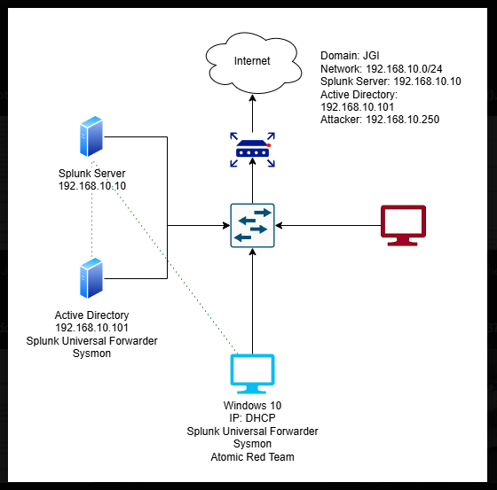
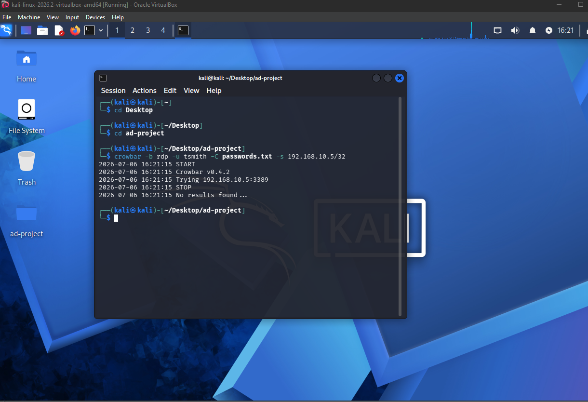
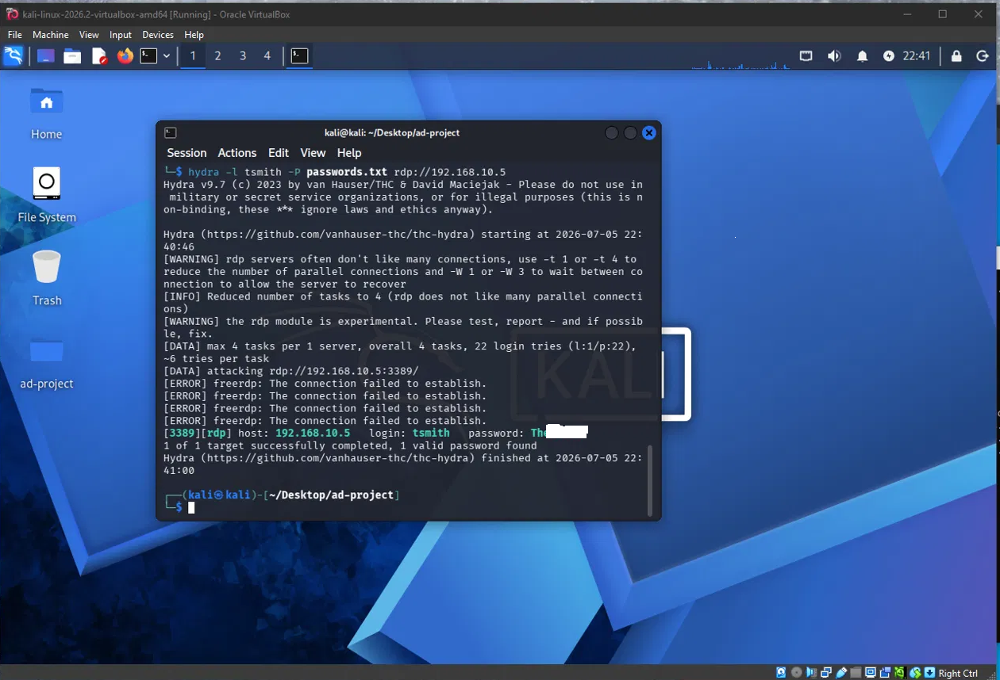
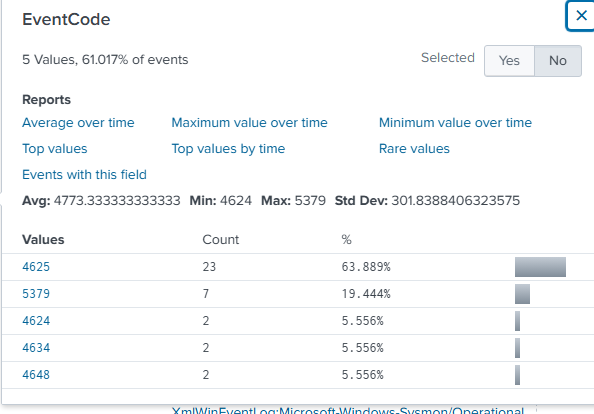
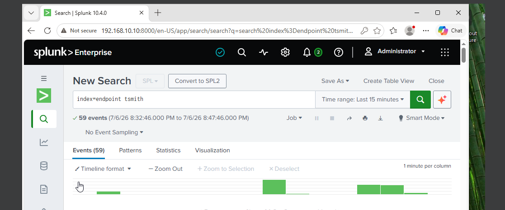
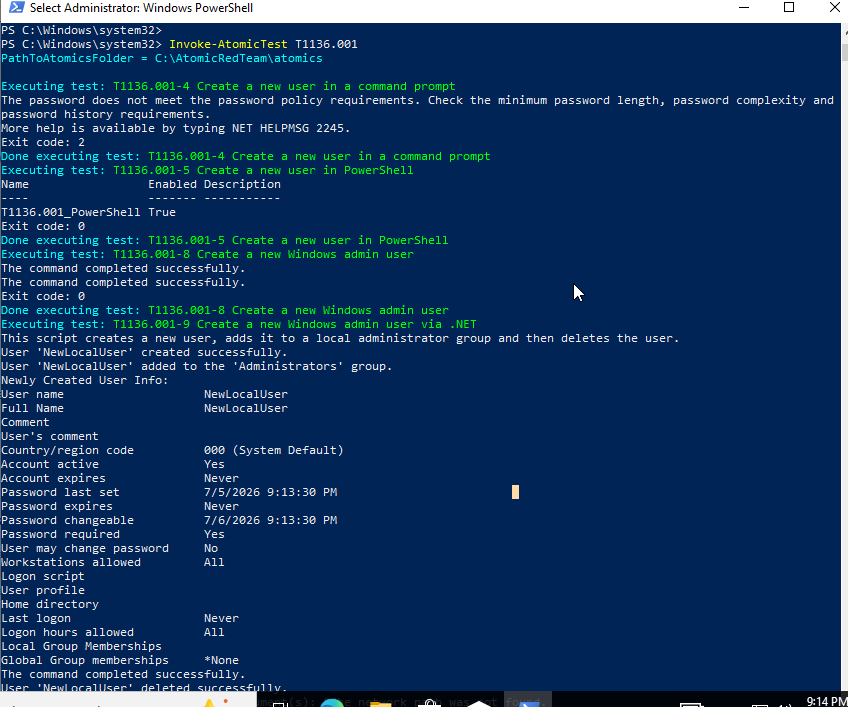
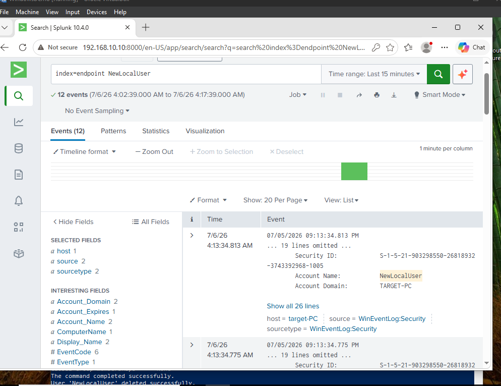

# Detecting Brute Force Authentication and Post-Compromise Activity in a Windows Active Directory Environment

    

**Author:** Jose Galdamez-Interiano
**Date:** July 2026
**Lab based on:** [MyDFIR — Active Directory Project (Home Lab)](https://www.youtube.com/@MyDFIR) series

---

## Objective

Build a fully functional Active Directory domain environment from scratch to simulate real-world attack scenarios against domain-joined machines, and use Splunk as a SIEM to monitor, detect, and triage those attacks the way a SOC Tier 1 analyst would. The project simulates both an initial-access technique (brute force authentication) and a post-compromise persistence technique (local account creation), in order to evaluate detection coverage across more than one stage of the attack lifecycle — not just the point of entry.

## Project Environment

| Component | Details |
|---|---|
| **Domain Controller** | Windows Server 2025, AD DS + DNS roles, domain `JGI` |
| **Target Machine** | Windows 10 Enterprise, domain-joined, Sysmon installed (Olaf Hartong config) |
| **Attacking Machine** | Kali Linux 2026.2 |
| **SIEM** | Ubuntu 25.04, Splunk Enterprise, Universal Forwarder shipping logs on port 9997 |
| **Network** | Internal NAT network, `192.168.10.0/24` |

**Network layout:**
- Splunk Server: `192.168.10.10`
- Active Directory / Domain Controller: `192.168.10.101`
- Attacker (Kali): `192.168.10.250`
- Windows 10 target: DHCP-assigned (`192.168.10.5` at time of testing)

### Architecture



---

## Attack 1 — Brute Force Authentication (T1110.001)

### Simulation

Used the `crowbar` tool on Kali to run a password-guessing attack against the domain account `tsmith` via the RDP service on the target machine, using a custom wordlist based on `rockyou.txt.gz`.

```bash
crowbar -b rdp -u tsmith -C passwords.txt -s 192.168.10.5/32
```

### Troubleshooting

The first run produced no successful crack, despite the correct password being present in the wordlist:



Rather than assuming the credential was wrong, I worked through the problem systematically to isolate the actual cause:

| Step | Result |
|---|---|
| Wrong target IP? | ✗ Ruled out — confirmed via `ipconfig` on the target |
| RDP not listening? | ✗ Ruled out — confirmed listening via `netstat -an \| findstr 3389` |
| User not authorized for RDP? | ✗ Ruled out — confirmed via Remote Desktop Users list |
| NLA blocking the connection? | ✗ Ruled out — confirmed via a successful manual `xfreerdp` connection using known-good credentials |
| **Root cause** | Crowbar's RDP module itself — a known reliability issue with modern Windows RDP stacks |
| **Resolution** | Switched to Hydra, which uses a more actively maintained RDP implementation |

**Environmental factor:** the MyDFIR tutorial series was built on Windows Server 2022, while this lab was built on Windows Server 2025. That version difference is a plausible contributor to Crowbar's RDP module failing here, since older tools built on the legacy `rdesktop` backend are known to struggle against newer Windows RDP stacks.

Switching to Hydra resolved the issue immediately:

```bash
hydra -l tsmith -P passwords.txt rdp://192.168.10.5
```



### Detection

Queried Windows Security Event ID 4625 (failed logon) and 4624 (successful logon) in Splunk to identify the attack pattern.

```spl
index=endpoint EventCode=4625 Account_Name=tsmith
| stats count by Account_Name, Source_Network_Address
```

**Finding:** the wordlist used contained 20 candidate passwords, with the correct password placed at the bottom of the list. This produced 20 counts of Event ID 4625 (failed logon attempts) against the `tsmith` account, followed by a single Event ID 4624 (successful logon) — directly correlating with the successful Hydra crack.



### Triage Decision

This pattern — high-volume authentication failures followed immediately by a successful logon — is consistent with a successful brute force compromise. In a production SOC, this would be escalated as a **Sev-2 incident**:
- Disable the affected account
- Force a password reset
- Review subsequent activity on the account for signs of further compromise

### Detection Tuning

Initial testing with a 3-failure threshold generated false positives from legitimate users mistyping passwords during normal login. Increasing the threshold to **5+ failures within a 2-minute window** preserved detection of the simulated attack while significantly cutting false positive volume during a control period of normal use.



---

## Attack 2 — New Local User Creation via Atomic Red Team (T1136.001)

### Objective

Test the monitoring and alerting capability of the Splunk SIEM against a common post-compromise persistence technique, and identify any detection blind spots in the current logging configuration.

### Simulation

Installed Atomic Red Team on the target Windows 10 machine and executed technique **T1136.001 — Create Account: Local Account** to simulate an attacker establishing persistence after initial compromise.

```powershell
Invoke-AtomicTest T1136.001
```

The test ran multiple sub-tests, including creating a standard local user and creating a local user added directly to the **Administrators** group.



### Detection

Queried Windows Security Event ID 4720 (account created) and Event ID 4732 (member added to a security-enabled local group) in Splunk.

```spl
index=endpoint (EventCode=4720 OR EventCode=4732)
| table _time, EventCode, Account_Name, Group_Name, Computer
```

**Finding:** Splunk successfully captured the account creation event for `NewLocalUser`, confirming that the current log forwarding and indexing configuration provides adequate visibility into local account management activity — no detection gap was found for this technique. Critically, the sub-test also confirmed the account was added to the **local Administrators group**, captured under Event ID 4732 alongside the account creation event.



### Triage Decision

Local account creation alone is a moderate-severity indicator, since it can occur through legitimate IT administration. However, the correlation of **account creation immediately followed by addition to the local Administrators group** substantially raises the severity of this finding — this specific pattern (new account + immediate privileged group membership) is a well-documented persistence technique used to maintain administrative access even if the attacker's original compromised credentials are later reset.

Given this, I would classify this as a **Sev-1 event requiring immediate response**, specifically because of the privilege escalation component:
- Immediately disable the newly created account
- Remove it from the Administrators group if still present
- Cross-reference with IT/helpdesk change-management logs to confirm whether the account creation was authorized
- If unauthorized, treat as confirmed compromise and begin a full host investigation — reviewing for additional persistence artifacts such as scheduled tasks, registry Run keys, or additional accounts created around the same timeframe

**Relationship to Attack 1:** this test was executed independently of the earlier brute-force simulation, rather than as a direct continuation of that specific compromise. That said, in a real-world intrusion, this exact sequence — credential compromise via brute force, followed by creation of a privileged local account — is a textbook attack chain. An analyst observing both event types on the same host within a short time window should treat them as a single correlated incident rather than two unrelated low-priority alerts, since the combination substantially increases confidence that the activity is malicious rather than benign IT administration.

---

## Detection Coverage Summary

| Technique | MITRE ATT&CK ID | Detected? | Data Source |
|---|---|---|---|
| Brute Force Authentication | T1110.001 | ✅ Yes | Event ID 4625, 4624 |
| New Local User Creation | T1136.001 | ✅ Yes | Event ID 4720, 4732 |

## Gaps & Future Work

- Current detections rely on static thresholds; next iteration will explore Splunk's `streamstats` for adaptive baselining.
- No detection currently exists for lateral movement (e.g., Pass-the-Hash) following compromise — planned for the next phase.
- Alerting is currently manual, query-based; next step is converting these into scheduled Splunk alerts with email/webhook notification.
- Planned additions: Kerberoasting (T1558.003) and domain account discovery (T1087.002) detections.

## Conclusion

Building the detection logic taught me that raw event visibility isn't enough — tuning thresholds against a baseline of normal behavior is what separates a usable alert from an unusable one. I also learned to think about attacks as a chain of events rather than isolated incidents, which changed how I approached correlating the brute force and account-creation activity into a single timeline. Troubleshooting Crowbar's failure against a modern Windows RDP stack also reinforced that tooling reliability itself is something an analyst has to account for — a failed attack simulation isn't always a dead end, it's a diagnostic problem to work through.

---

## Repository Structure

```
AD-SOC-Home-Lab/
├── README.md
├── diagrams/
│   └── architecture.png
├── screenshots/
│   ├── 01-crowbar-failed-attempt.png
│   ├── 02-hydra-successful-crack.png
│   ├── 03-splunk-detection-tuning-search.png
│   ├── 04-splunk-tsmith-events.png
│   ├── 05-atomic-redteam-t1136-execution.png
│   └── 06-splunk-newlocaluser-detection.png
└── detections/
    ├── brute_force_detection.spl
    └── local_account_creation_detection.spl
```
